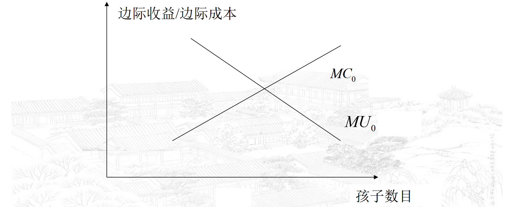

|学年学期|2024-2025学年第一学期|
|------------|---------------|
|自然学期|2024年秋季学期|
|正式名称|发展经济学|
|使用教材|姚洋《发展经济学（第二版）》|
|学生层次|本科生|

## 1 Introduction

### Casual Talk

Angus Deaton 从需求出发研究发展中国家的消费者行为。

该学科相关电视剧包括但不限于《山海情》《一年又一年》

### About

### 二十世纪世界增长史

### 中国增长史

### 影响经济发展的因素

## 2 Growth Theories

### 2.1 Introduction

### 2.2 Harrold-Domar Model

### 2.3 Solow Model

#### 2.3.1 求解

#### 2.3.2 收敛

#### 2.3.3 经验研究

#### 2.3.4 模型变形

#### 2.3.5 技术增长

### 2.4 Endogenous Growth Model

## 3 Technological Change

### 2.1 种类

#### 2.1.1 中性技术进步

#### 2.1.2 资本偏向型

#### 2.1.3 劳动偏向型

#### 2.1.4 增强劳动型

#### 2.1.5 增强资本型

#### 2.1.6 种类总结

### 2.2 度量

#### 2.2.1 Solow 残差的问题

##### 复习索洛模型

##### 统计误差

##### 要素变化率

##### Embedded 技术进步

&emsp;&emsp;附着于劳动力的技术进步主要是指劳动力知识水平和技能的提高，在一定程度上，它可以通过教育水平来度量。但是，要度量附着于资本的技术进步却是极端困难的。

### 2.2.2 改进：用投入衡量

研发投入

人力资本

专利申请

粗入学率的分母是同年龄段总人口，但有复读的人（和其他特殊情形），所以会出现大于100%的情况

### 2.3 比较优势

诺斯在《经济史的结构和变迁》(North, 1981) 一书中以原始农业为例说明：  
技术进步的原因之一是，生产要素的相对价格发生了变化。

> 对于原始农业而言，有两种办法增加农业产量，一个是外部拓展，比如开荒，另一个是内部拓展，即发掘现有土地的能力，如灌溉。  
> 在农业生产的初期，人们可以开垦离居住地较近的土地，开发新的土地的边际成本较低；随着时间的推移，人们不得不开垦远处且地理条件比较复杂的土地，因此边际成本提高。  
> 而灌溉具有一定规模经济，一旦修好水渠，边际成本不变，直到一段时
间之后。

#### 诱导性技术变迁

定义：  
&emsp;&emsp;起初可能不会发生技术变迁，但随着要素相对价格变化，人们倾向于采用更密集地使用变得更为便宜的要素的技术，技术变迁有可能发生。

## 4 Population Growth

### 4.1 Introduction

人口数量

人口质量

人口结构

### 4.2 Malthus

#### 4.2.1 基本假设

1. 社会中存在一个刚好可以维持个人生存的生存工资，如果一个人的收入低于生存工资，则他就无法存活。
2. 只要收入高于生存工资，多余的收入就会被用作人口的再生产，人口就会开始增长。而且，人口增长速度是多余收入的增函数。
3. 收入水平受到自然资源的约束；由于自然资源是有限的，收入的增长也是有限的。

#### 4.2.2 简单模型

变量|解释|备注
:-:|:-:|:-:
$t$|年份|视为连续
$n_t$|人口数量|假定等于劳动力
$\hat{n_t}$|人口增长速度|视为连续
$y_t$|人均收入|
$\bar{y_t}$|生存收入
$\bar{R}$|自然资源总量
$A$|全要素生产率 

单一生产活动的总产出（总收入）
$$
Y_t = A F ( \bar{R},n_t )
$$
假设规模报酬不变，那么人均收入有
$$
y_t = \dfrac{
    A \cdot  n_t \cdot f \left( \dfrac{
            \bar{R}
        }{n_t}, 1 \right)
    }{n_t} = A \cdot f
\left( 
    \dfrac{\bar{R}}{n_t} 
\right)
$$
人均收入是人口数量的减函数，以此刻画第三个假设。

刻画前两个假设的人口增长方程
$$
\hat{n_t} = \beta ( y_t - \bar{y} )
$$
将 $y_t$ 表达式代入得
$$
\hat{n_t} = \beta \left(
    A \cdot f
\left( 
    \dfrac{\bar{R}}{n_t} 
\right)
    - \bar{y}
    \right)
$$
记 $\dot{n_t} = \dfrac{\mathrm{d}n_t}{\mathrm{d}t}=\hat{n_t} \cdot n_t$ 为人口增长量，对年份 $t$ 求导有 
$$
\begin{aligned}
    \dfrac{\mathrm{d} \hat{n_t}}{\mathrm{d} t}
    =
    - \beta A \cdot f' \left( \dfrac{\bar{R}}{n_t} \right) \cdot \bar{R} \cdot
    \dfrac{\dot{n_t}}{n_t^2} \\
    =
    - \beta A \cdot f' \left( \dfrac{\bar{R}}{n_t} \right) \cdot \bar{R} \cdot
    \dfrac{\hat{n_t}}{n_t}
\end{aligned}
$$

情况|人口|人口增长率正负|人口增长率增减
:-:|:----:|:-:|:-:
$y>\bar{y}$|$\hat{n_t}>0$|$\dfrac{\mathrm{d}\hat{n_t}}{\mathrm{d}t}<0$|随时间减小
$y<\bar{y}$|$\hat{n_t}<0$|$\dfrac{\mathrm{d}\hat{n_t}}{\mathrm{d}t}>0$|随时间增大

#### 4.2.3 结论

### 4.3 Becker

#### 4.3.1 生育的收益—成本分析

##### 边际收益递减

##### 边际成本上升

#### 4.3.2 影响生育选择的因素

##### 4.3.2.1 教育水平

|曲线|教育水平提升时|
:-:|:-:
MC |上升 / 左移
MU |下降 / 左移

##### 4.3.2.2 收入水平

|收入水平上升时|MC 曲线|MU 曲线
:-:|:-:|:-:
时间成本 | 上升 / 左移| 
财富效应 | | 上升 / 右移
消费品之间的替代效应| | 下降 / 左移

总结：净效应不确定

##### 4.3.2.3 劳动参与

|劳动参与下降时|MC 曲线|MU 曲线
:-:|:-:|:-:
时间机会成本 | 下降 / 右移 |
| | | 上升 / 右移

##### 4.3.2.4 人力资本回报

社会人力资本回报提高时，增加孩子的教育投资

MU 曲线 左移 / 下降

##### 4.3.2.5 社会保障

|社会保障更健全时|MC 曲线|MU 曲线
:-:|:-:|:-:
生育服务设施健全| 下降 / 右移 | |
养老和医保健全| | 下降 / 左移

##### 4.3.2.6 宗教和社会习俗

影响 MU 曲线的位置

### 4.4 人口转型｜人口红利

词汇|定义
:-:|:-:
劳动人口|年龄在 $(15,65)$
被抚养人口| $(0,15)\cup(65,+\infty)$
劳动人口比| $\dfrac{\text{劳动人口}}{被抚养人口}$

在「三阶段」中，第二阶段后半段的人口结构相对于其它两个阶段具有经济增长优势。在这个阶段， 劳动人口相对于被抚养人口更丰富，从而可能有利于经济增长，即为「人口红利」

可能的作用途径：
- 抚养负担轻
- 劳动力供给
- 创造力

### 4.5 中国人口问题

#### 4.5.1 生育率基本现状

#### 4.5.2 计划生育

##### 4.5.2.1 回顾重述

##### 4.5.2.2 对人口结构的影响

###### 4.5.2.2.1 社会抚养比

2023年总和生育率：1.05

2023年60岁以上人口占比：21.1%

劳动人口占比从2010年起已显现下降趋势

可能弱化老龄化冲击的因素：
- 退休年龄提高
- 教育水平提高  
    扩展：产业结构升级可达预期吗
- 人工智能进步  
    扩展：对劳动力市场的长期效应

###### 4.5.2.2.2 性别比

##### 4.5.2.3 对其他社会结果的影响

###### 4.5.2.3.1 子女教育

###### 4.5.2.3.2 劳动参与 离婚率 人口流动

###### 4.5.2.3.3 妇女地位和劳动参与率