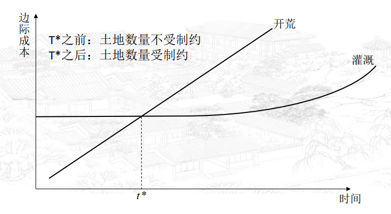

## 1 种类

### 1.1 中性技术进步

### 1.2 资本偏向型

### 1.3 劳动偏向型

### 1.4 增强劳动型

### 1.5 增强资本型

### 1.6 种类总结

## 2 度量

### 2.1 Solow 残差的问题

##### 复习索洛模型

##### 统计误差

##### 要素变化率

##### Embedded 技术进步

&emsp;&emsp;附着于劳动力的技术进步主要是指劳动力知识水平和技能的提高，在一定程度上，它可以通过教育水平来度量。但是，要度量附着于资本的技术进步却是极端困难的。

## 2.2 改进：用投入衡量

研发投入

人力资本

专利申请

粗入学率的分母是同年龄段总人口，但有复读的人（和其他特殊情形），所以会出现大于100%的情况

## 3 比较优势

诺斯在《经济史的结构和变迁》(North, 1981) 一书中以原始农业为例说明：  
技术进步的原因之一是，生产要素的相对价格发生了变化。

> 对于原始农业而言，有两种办法增加农业产量，一个是外部拓展，比如开荒，另一个是内部拓展，即发掘现有土地的能力，如灌溉。  
> 在农业生产的初期，人们可以开垦离居住地较近的土地，开发新的土地的边际成本较低；随着时间的推移，人们不得不开垦远处且地理条件比较复杂的土地，因此边际成本提高。  
> 而灌溉具有一定规模经济，一旦修好水渠，边际成本不变，直到一段时
间之后。

#### 诱导性技术变迁

定义：  
&emsp;&emsp;起初可能不会发生技术变迁，但随着要素相对价格变化，人们倾向于采用更密集地使用变得更为便宜的要素的技术，技术变迁有可能发生。
