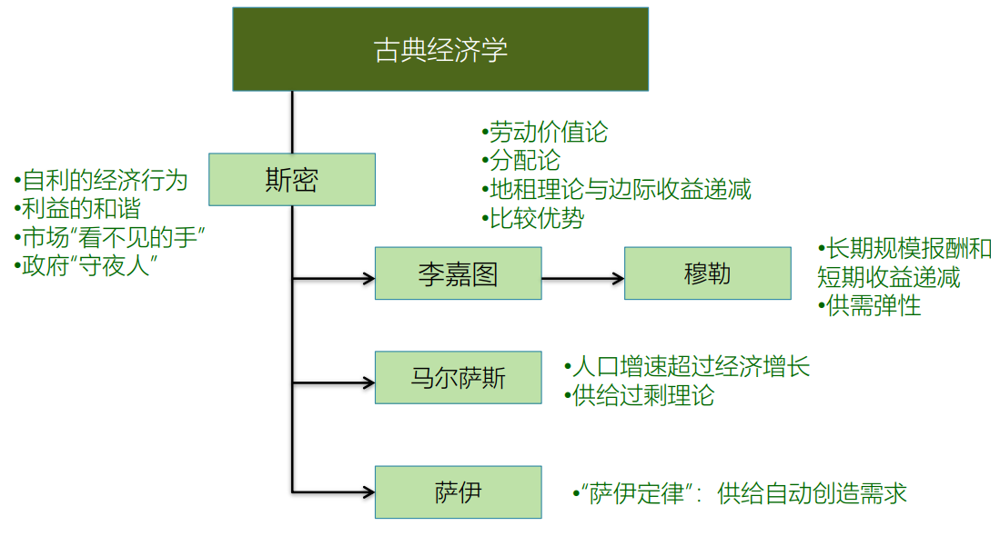
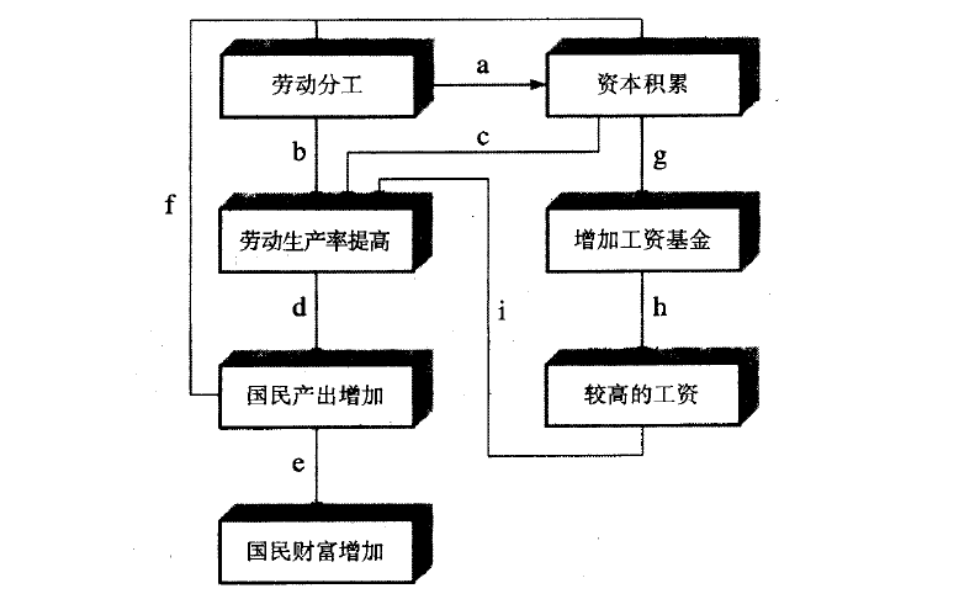

## 早期经济思想

### 重商主义

### 重农主义

## Adam Smith & 古典

### 概览

#### 内部关系图

#### 历史背景

#### 基本信条

（古典学派也被熟知为经济自由主义）  
- 最低限度的政府干预  
- 自利的经济行为  
- 利益的和谐（李嘉图除外，个人利益 → 社会利益）  
- 所有的经济资源和经济活动都很重要  
经济资源&emsp;`土地`&emsp;`劳动力`&emsp;`企业家才能`  
经济活动&emsp;`农业`&emsp;`商业`&emsp;`工业生产`&emsp;`国际贸易`
- 经济规律是普遍的且无法改变的  
例如：  
劳动价值论  
萨伊定律  
人口论  
地租理论  
比较优势理论

#### 人物

### 本身

#### 《国富论》

#### 分工

斯密把分工看作是劳动生产率提高的最大贡献者  
摘自《国富论》第一章：  
> 劳动生产力的最大改进，以及劳动在任何地方运作或应用中所体现的技能、 熟练和判断的大部分，似乎都是劳动分工的结果。

> 由于实行劳动分工的所有不同行业的产量成倍增长，在治理很好的社会出现普遍的富裕。

#### 增长的源泉

#### 利益和谐

#### 市场调节

#### Smith 简图

### 观察

#### 长远影响

- 为经济学奠定了坚实的社会哲学基础，从而有利于其今后在更广阔的领域、空间发展。  
- 第一次使经济学成为一门比较系统化的社会科学。  
- 经济自由主义的奠基人。

#### 经济自由是绝对的吗

- 自由放任主义在处理哪些经济问题上是不足够的？  
- 西方国家以政治自由为条件给非洲政府经济援助，希望达到经济自由促进经济增长。30年过去了，受援助的非洲国家陷入内乱中，经济并无起色。

#### 对市场有效的批评

> 张维迎《新古典经济理论的八大悖论》之  
> 「看不见的手」与「别针工厂」（分工定理）的矛盾  
> ——市场的有效性以市场的不存在为前提  
> 
> 「根据福利经济学第⼀定理，只有完全竞争市场才能达到帕累托最优，因而是最有效率的市场，任何偏离完全竞争都会导致资源配置的效率损失」
> 
> 完全竞争的前提是没有规模经济，但市场存在的前提是分工和专业化，而分工和专业化的前提是报酬递增
>
>「逻辑上，最有效率的市场以市场不存在为前提，导致市场出现的因素反倒成了市场失灵的因素」

## 马尔萨斯＆人口论

### 概览

#### 人物概览

- 1766－1834
- 出生于英国一个土地贵族家庭，和休谟、卢梭等人都有交往，思想激进
- 1784年入剑桥大学耶稣学院学习
- 1796年，他到萨立州的奥尔巴当牧师
- 1798年代表作《人口论》
- 1805年被聘为东印度学院的历史和政治经济学教授
- 以人口论著名，备受争议

#### 历史背景

### 人口论

#### 本身

#### 政策含义

节育政策、反对废除战争和补贴穷人的政策  
> &emsp;&emsp;无论生活资料以多么快的方式增长，人口的增长总会受到它的限制。所有在保持正常的人口水平之外出生的儿童必然都将面临死亡，除非成人死亡为他们腾出生存空间……从而，我们应该促进大自然在制造死亡率方面的作用，而不应阻碍其作用……我们不应该鼓励建议穷人保持清洁卫生，而是应该鼓励相反的习惯。在我们的城镇里，我们应该使街道变得更窄，让房子里住进更多的人，从而招致瘟疫的发生。在农村，我们应该将村子建在死水塘附近，并且特别鼓励定居在沼泽地及其他不卫生的地方……  
如何评价？

#### 人口论影响

- 直接导致英国1834《济贫法》的修正：使公共救助让人无法忍受。
- 托马斯 · 卡莱尔（十九世纪中叶的史学家）读了马尔萨斯的著作后，称政治经济学「十分可怕」！
- 人口论的相对适用性：关于人口增长与贫困、营养不良、疾病的预测在贫穷的国家仍是非常真实的；2000—2010年，世界上每出生10个人，9个生活在发展中国家

#### 历史借鉴

- 阿玛蒂亚 · 森的饥荒理论
- 繁荣饥荒和衰退饥荒
> 阿玛蒂亚 · 森  
> 「饥荒的发生常常是在那些食物即使不充裕，至少也算足够维持人口补给的地方」

### 供给过剩理论

#### 本身

- 古典学派多认为只存在某些特殊商品的过剩，或称局部过剩，一般商品过剩则不存在。  
（供给创造本身的需求，萨伊法则）

- 马尔萨斯有效需求不足理论  
    因为工人阶级的工资不可能超出产出价值，所以不能购买全部的社会产出；资本家会以资本品的形式购回部分产出，但他们的目标是积累财富。因此资本主义社会就存在着一般商品生产过剩的可能性。（凯恩斯思想的理论渊源）

#### 对供给过剩的政策建议

## 李嘉图

### 概览

### 劳动价值论

#### 内容

#### 矛盾

### 地租理论

**广延边际地租** / 第一类级差地租  
土地肥力差异引起级差地租

**集约边际地租** / 第二类级差地租  
不同集约度（投资水平）土地上耕种所得收益差异引起级差地租（集约耕种的边际产量递减）

:::tip[剩余原理 / Leftover Principle]
前提：土地总量固定  
对土地的竞争导致投资的经济利润 $=0$  
地租 $=$ 非土地成本之外的经济剩余
:::

### 分配论

#### 工资

工人在长期仅得到维持个人和家庭生活的最低工资——「工资铁律」

#### 利润

一国不同行业间的企业利润率趋于均等化  
产出价格的变化影响利润率进而影响资本的流动
- 长期来看，利润下降
- 利润率的下降不利于资本积累和投资，因此在经济政策上李嘉图反对地主阶级为维持高地租而实施的干预——反对《谷物法》

#### 地租

长期来看，地租上升

### 比较优势

## 边沁｜萨伊｜穆勒

### 边沁 Jeremy Bentham

功利主义  
- 哲学基础：享乐主义 Hedonism  
（人们追求可以带来快乐的东西，回避会产生痛苦的东西）
- 道德伦理原则：应引导人们的行为使之促进最大多数人的最大幸福  
- 「效用」的概念

政策含义  
> 若政府的一项措施所增加的集体的幸福大于所减少的幸福，则这些政府措施被认为是符合效用原理的

:::tip[历史意义]
功利主义构成了边际学派的理论基础  
——效用最大化和边际效用递减的概念

通过比较成本与收益而进行理性选择的多数现代经济学思想，都植根于边沁提出的人类行为概念。

现代经济学在此基础上考虑了人们行为的其他动机  
歧视、婚姻、犯罪、吸毒……  
> 加里 · 贝克尔《人类行为的经济分析》

:::

### 萨伊 Jean-Baptiste Say

「萨伊定律」供给会创造出它自己的需求  
（新古典经济学的理论基础）

- 否认资本主义生产过剩经济危机爆发的可能性

三原理  
- 产品是以产品来购买的，货币只不过是交换的媒介
- 生产给产品创造需求
- 只要对生产不加干涉，就不会发生普遍生产过剩

### 穆勒 John Stuart Mill

1848 年出版代表作《政治经济学原理》

教育经历严苛  
- 13 岁学习政治经济学  
- 15—18 岁编辑出版了边沁的 5 卷手稿  
- 19 岁开始发表独创性学术论文  
- 20 岁得了神经衰弱  

他成年时，古典学派开始衰败

## 古典学派的主要成就

(1)劳动成本说：劳动是主要的成本，会影响相对价格

(2)货币的中立性：货币是一层面纱，外汇与货币供给的增加，只会改变物价，不会改变国家的财富

(3)劳动与资本的比例固定：在技术创新不明显的时代，劳动与资本的搭配比例，在短时间内不易改变

(4)农业部门的报酬递减，工业部门的报酬大致固定，要到19世纪中叶才出现报酬递增

(5)基本上假设充分就业——供给自动创造需求

(6)认为人口论（或马尔萨斯陷阱）是成立的