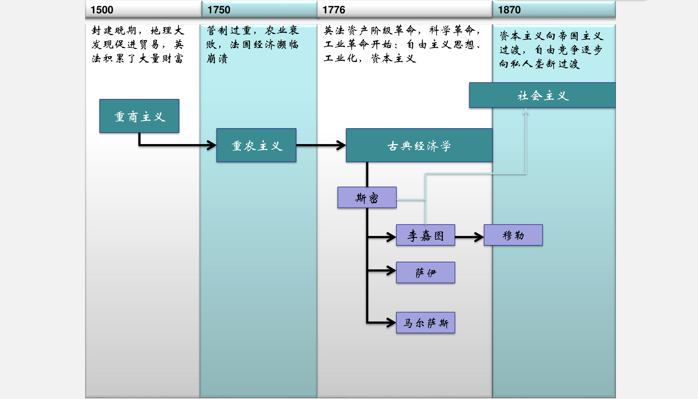

经济思想史需置于经济史的动态发展中理解。

### 关键问题

1. 学派产生的历史背景是什么？  
`大部分经济理论（通常是革命式的）产生于应对剧变的经济环境`  
2. 该学派的主要信条是什么？  
`在概括时，适当追求一般化，适当牺牲多样性`  
3. 该学派对谁有利或为谁谋利？  
4. 该学派是如何在当时成为有效的理论体系的？  
`过去的知识不见得是过时和错误的`  
`曾经正确的理论不会一直正确`  
5. 该学派的哪些信条具有长远影响？另考虑其局限或错误。

### 经济学思想在西方产生的社会背景

西方中世纪教会  
`欲望即罪恶`

中世纪后期宗教改革  
`享乐主义、个人主义、利己主义哲学`  
——「人的本性就是欲望（效用）满足」

古典时期  
`边沁的功利主义 (utilitarianism)`  
——「最大多数人的最大幸福」

### 两类问题

`哲学层次` 市场如何产生  
`实用主义` 市场如何运行

### 经济学的「实用化」

> 在 Adam Smith 之后，西方国家法治化市场经济运作体制生成，「市场经济理论传道人」历史使命随之结束

> **Stigler**  
> 新古典时期之后，经济学家们不再关心人类社会是如何运作的这类「经邦济世」的大学问了，而只是做些解释现实经济现象的「实际功夫」

> **《资本论》**  
>「庸俗经济学的丧钟已经敲响了」

> **罗宾斯**  
> 经济学的本质是研究资源稀缺条件下，人类在配置资源方面是如何行为的形式化社会科学。

#### 现代经济学的分析范式

#### 现代实证主义的分析范式

### 经济史维度下的经济思想史

$$
新的经济问题 \\
\Downarrow \\
新的政策建议 \\
\Downarrow \\
新的经济理论
$$
人们只能根据时代需要寻找解决问题的理论办法，因此不可依据流行度评判流派或学说的优劣。

### 课程学习要求

**基础**  
- 熟悉经济学基本理论：微观、宏观、计量

**目标**  
- 了解各时期构成主流经济学基本框架的重要理论  
- 找到感兴趣的领域，且理解、掌握、应用该领域的理论进展  

### 推荐读物

[瑞典银行经济学奖](https://www.nobelprize.org/prizes/uncategorized/all-prizes-in-economic-sciences/)  
[克拉克奖](https://www.aeaweb.org/about-aea/honors-awards/bates-clark)  
*Journal of Economic Perspective*

